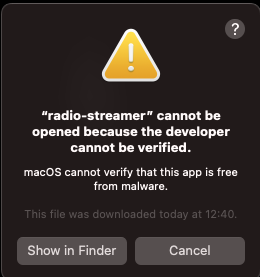

# RadioStreamer

RadioStreamer is an open-source command-line tool written in Go that allows you to stream radio stations using VLC as the streaming platform. With RadioStreamer, you can easily configure your favorite radio stations through a YAML configuration file, making it a convenient way to enjoy your preferred radio channels on Linux and MacOS.

## Features

- Stream radio stations using VLC as the backend.
- Configure your own list of radio stations through a YAML configuration file.
- Cross-platform support for Linux and MacOS.

## Prerequisites

Before you get started with RadioStreamer, ensure that you have the following prerequisites installed on your system:

- [VLC Media Player](https://www.videolan.org/vlc/index.html): Make sure VLC is installed and accessible from the command line.
> :information_source: To be able to access it from the command line, if you haven't already, just add a symbolink link to the bin folder:
>
> ```bash sudo ln -s /Applications/VLC.app/Contents/MacOS/VLC /usr/local/bin/vlc```

## Download

You can download the RadioStreamer binary for your platform from the [Releases](https://github.com/phildp/radio-streamer/releases) page.

- [Download RadioStreamer for Linux](https://github.com/phildp/radio-streamer/releases/latest/download/radio-streamer_0.0.4_linux_amd64.tar.gz)
- [Download RadioStreamer for macOS](https://github.com/phildp/radio-streamer/releases/latest/download/radio-streamer_0.0.4_darwin_amd64.tar.gz)

Choose the appropriate binary for your operating system and architecture.


## Installation
To install RadioStreamer on Linux and MacOS without requiring the user to have Go installed, download the pre-built executables and add them to your PATH.

1. Download the binary for your platform from the links above.
2. Extract the binary from the downloaded .tar.gz file:

   ```bash
   tar -xzf radio-streamer_0.0.4_linux_amd64.tar.gz  # For Linux
   tar -xzf radio-streamer_0.0.4_darwin_amd64.tar.gz # For macOS
   ```

3. Change directory and move the executable to a location in your PATH to make them accessible system-wide:

	```bash
	cp radio-streamer_0.0.4_linux_amd64.tar.gz/
	sudo mv radio-streamer_0.0.4_linux_amd64/radio-streamer /usr/local/bin/radio
	```

4. Validate that everything works:

	```bash
	radio --help
	```

## FAQ
**In MacOS I see the following screen:**



Go to **System Settings > Privacy & Security > Privacy > Developer Tools** and then add and enable your preferred Terminal.

## Configuration

1. Create a configuration folder in your home directory if it doesn't already exist:

	```bash
	mkdir -p ~/.config/radio
	```

2. Download the `stations.yml` and move it to `~/.config/radio/`


3. The config file looks like this:

    ```yaml
    stations:
	  imagine: 
	    title: Imagine 89.7
	    filename: http://jett.shoutca.st:8004
	  parapolitika: 
	    title: Parapolitika FM
	    filename: http://netradio.live24.gr/athinaradio
	  kiss:
	    title: Kiss FM
	    filename: /home/phildp/.config/radio/kiss.pls
      # Add more stations as needed
    ```

   Add more URLs and station names with the stations you want to stream.

   > :information_source: You can also add a stream file from the local filesystem. Some stations don't provide a remote URL.


## Usage

To start streaming your favorite radio stations, use the `radio start` command followed by the station name and the optional --volume flag:

```bash
radio start --station "myfavoriteradio" --volume 0.8
```

Replace `"myfavoriteradio"` with the name of the station you want to listen to, and `0.8` with the desired volume level (a value between 0 and 1, where 0 is mute and 1 is full volume). If you do not specify the --volume flag, the default volume will be used.

You can also list all the available stations from the config file:

```bash
radio list
```


## Contributing

We welcome contributions from the community. If you want to contribute to RadioStreamer, please follow these guidelines:

1. Fork the repository.
2. Create a new branch for your feature or bug fix.
3. Submit a pull request to the main repository.

## License

RadioStreamer is licensed under the [MIT License](LICENSE). Feel free to use, modify, and distribute it as per the terms of the license.

## Acknowledgments

- RadioStreamer is built upon the [VLC Media Player](https://www.videolan.org/vlc/index.html), which is a powerful and versatile media player.
- RadioStreamer uses the [spf13/cobra](https://github.com/spf13/cobra) library for building powerful and efficient command-line applications.

Enjoy streaming your favorite radio stations with RadioStreamer! If you encounter any issues or have suggestions for improvement, please open an issue on the GitHub repository.